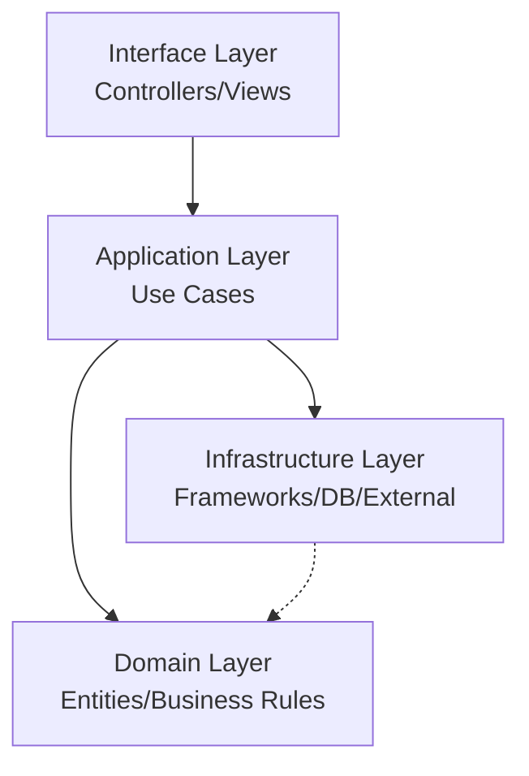

# Clean Architecture Implementation

## Overview



## Layer Details

### 1. Domain Layer (Innermost)
- Location: `app/shared/domain/`
- Contains:
  ```
  domain/
  ├── auth/
  │   ├── entities/         # Domain entities
  │   ├── repositories/     # Repository interfaces
  │   └── services/        # Domain services
  ├── discord/
  └── monitoring/
  ```

### 2. Application Layer
- Location: `app/shared/application/`
- Contains:
  ```
  application/
  ├── use_cases/
  │   ├── auth/
  │   ├── discord/
  │   └── monitoring/
  ├── services/
  └── interfaces/
  ```

### 3. Infrastructure Layer
- Location: `app/shared/infrastructure/`
- Contains:
  ```
  infrastructure/
  ├── models/              # SQLAlchemy entities
  ├── repositories/        # Repository implementations
  ├── database/
  └── services/
  ```

### 4. Interface Layer
- Location: `app/shared/interface/`
- Contains:
  ```
  interface/
  ├── api/
  ├── controllers/
  └── views/
  ```

## Dependency Flow
1. Domain Layer has NO external dependencies
2. Application Layer depends on Domain Layer
3. Infrastructure Layer implements Domain interfaces
4. Interface Layer uses Application Layer

## Implementation Examples

### Domain Entity
```python
# app/shared/domain/auth/entities/user.py
class User:
    def __init__(self, id: str, username: str):
        self.id = id
        self.username = username
        
    def change_username(self, new_username: str) -> None:
        if not new_username:
            raise ValueError("Username cannot be empty")
        self.username = new_username
```

### Repository Interface
```python
# app/shared/domain/auth/repositories/user_repository.py
from abc import ABC, abstractmethod
from ..entities.user import User

class IUserRepository(ABC):
    @abstractmethod
    async def get_by_id(self, id: str) -> User:
        pass
```

### Infrastructure Implementation
```python
# app/shared/infrastructure/repositories/user_repository_impl.py
class UserRepositoryImpl(IUserRepository):
    def __init__(self, session: AsyncSession):
        self.session = session
        
    async def get_by_id(self, id: str) -> User:
        user_entity = await self.session.get(AppUserEntity, id)
        return self._to_domain(user_entity)
``` 