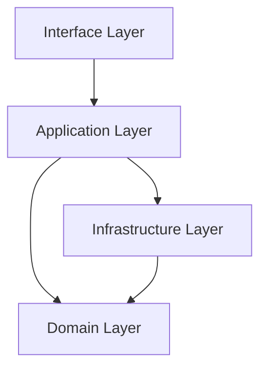

# HomeLab Discord Bot - Architecture Overview

## System Architecture



## Layer Responsibilities

### Domain Layer
- Business logic and rules
- Domain entities and value objects
- Repository interfaces
- Domain services
- Domain events

### Application Layer
- Use cases
- Application services
- Command/Query handlers
- DTOs and mapping
- Transaction management

### Infrastructure Layer
- Database implementation
- External services integration
- Repository implementations
- Logging implementation
- Security implementation

### Interface Layer
- API endpoints
- Controllers
- View models
- Request/Response handling

## Key Design Principles

1. **Dependency Rule**
   - Inner layers don't know about outer layers
   - Dependencies point inward

2. **Domain-Centric**
   - Business rules in domain layer
   - Domain models drive design

3. **Separation of Concerns**
   - Each layer has specific responsibility
   - Clear boundaries between layers

4. **Dependency Injection**
   - Loose coupling
   - Testable components

## Implementation Guidelines

1. **Domain Layer**
   ```python
   # Domain Entity
   class User:
       def __init__(self, id: str, username: str):
           self.id = id
           self.username = username
   ```

2. **Infrastructure Layer**
   ```python
   # Database Entity
   class UserEntity(Base):
       __tablename__ = 'users'
       id = Column(String, primary_key=True)
       username = Column(String)
   ```

3. **Application Layer**
   ```python
   # Use Case
   class CreateUserUseCase:
       def __init__(self, user_repository: IUserRepository):
           self.user_repository = user_repository
   ```

4. **Interface Layer**
   ```python
   # Controller
   class UserController:
       def __init__(self, create_user_use_case: CreateUserUseCase):
           self.create_user_use_case = create_user_use_case
   ``` 