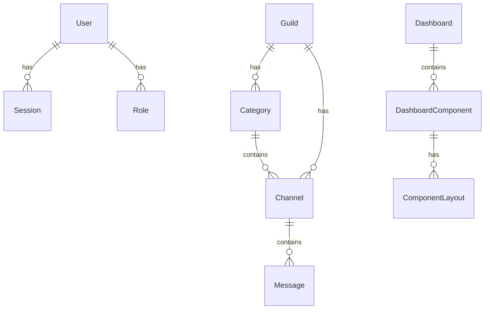

# Database Design Documentation

## 1. Entity Relationship Diagram



## 2. Table Schemas

```

```

## 3. Indexing Strategy

### 3.1 Primary Indexes
- All tables have primary key indexes
- Foreign key columns are automatically indexed

### 3.2 Performance Indexes
```sql
-- User lookups by discord_id
CREATE INDEX idx_users_discord_id ON users(discord_id);

-- Channel ordering within guild
CREATE INDEX idx_channels_guild_position ON channels(guild_id, position);

-- Component ordering within dashboard
CREATE INDEX idx_components_dashboard_position 
ON dashboard_components(dashboard_id, position);
```

## 4. Migration Strategy

### 4.1 Using Alembic
```python
# migrations/env.py
from alembic import context
from app.shared.infrastructure.models import Base

target_metadata = Base.metadata
```

### 4.2 Migration Example
```python
"""Add user email verification
Revision ID: abc123def456
"""
from alembic import op
import sqlalchemy as sa

def upgrade():
    op.add_column('users', 
        sa.Column('email_verified', sa.Boolean(), nullable=False, server_default='false')
    )

def downgrade():
    op.drop_column('users', 'email_verified')
```

## 5. Backup Strategy

### 5.1 Automated Backups
```bash
#!/bin/bash
# backup.sh
pg_dump -Fc homelab_bot > backup_$(date +%Y%m%d_%H%M%S).dump
```

### 5.2 Retention Policy
- Daily backups kept for 7 days
- Weekly backups kept for 4 weeks
- Monthly backups kept for 12 months 