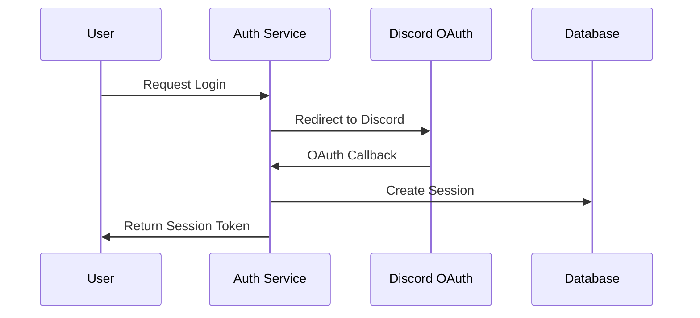

# Security Documentation

## 1. Authentication

### 1.1 User Authentication Flow


### 1.2 Session Management
```python
class SessionService:
    def create_session(self, user_id: str, ip: str) -> Session:
        token = self._generate_secure_token()
        expires = datetime.utcnow() + timedelta(days=7)
        
        return Session(
            user_id=user_id,
            token=token,
            ip_address=ip,
            expires_at=expires
        )
```

## 2. Authorization

### 2.1 Role-Based Access Control
```python
@dataclass
class Permission:
    resource: str
    action: str

class Role:
    def __init__(self, name: str):
        self.name = name
        self.permissions: Set[Permission] = set()
    
    def add_permission(self, resource: str, action: str):
        self.permissions.add(Permission(resource, action))
```

### 2.2 Permission Checking
```python
class AuthorizationService:
    async def check_permission(
        self,
        user_id: str,
        resource: str,
        action: str
    ) -> bool:
        user = await self.user_repository.get_by_id(user_id)
        if not user:
            return False
        
        return any(
            Permission(resource, action) in role.permissions
            for role in user.roles
        )
```

## 3. Data Protection

### 3.1 Encryption at Rest
```python
class EncryptionService:
    def __init__(self, key_service: KeyManagementService):
        self.key_service = key_service
    
    async def encrypt_sensitive_data(self, data: str) -> str:
        key = await self.key_service.get_current_key()
        return self._encrypt(data, key)
```

### 3.2 Data Sanitization
```python
class InputSanitizer:
    @staticmethod
    def sanitize_user_input(input_str: str) -> str:
        # Remove potential XSS
        input_str = html.escape(input_str)
        
        # Remove potential SQL injection
        input_str = re.sub(r'[\'";]', '', input_str)
        
        return input_str
```

## 4. Rate Limiting

### 4.1 Implementation
```python
class RateLimiter:
    def __init__(self, redis_client: Redis):
        self.redis = redis_client
    
    async def check_rate_limit(
        self,
        key: str,
        limit: int,
        window: int
    ) -> bool:
        current = await self.redis.incr(key)
        if current == 1:
            await self.redis.expire(key, window)
        return current <= limit
```

## 5. Audit Logging

### 5.1 Security Events
```python
class SecurityAuditService:
    async def log_security_event(
        self,
        event_type: str,
        user_id: str,
        details: dict
    ):
        await self.audit_repository.create(
            action=f"SECURITY_{event_type}",
            actor_id=user_id,
            details=details
        )
```

## 6. Security Headers

### 6.1 Configuration
```python
SECURITY_HEADERS = {
    'X-Frame-Options': 'DENY',
    'X-Content-Type-Options': 'nosniff',
    'X-XSS-Protection': '1; mode=block',
    'Strict-Transport-Security': 'max-age=31536000; includeSubDomains',
    'Content-Security-Policy': "default-src 'self'"
}
```

## 7. Regular Security Tasks

### 7.1 Key Rotation
```python
@scheduled_task(interval_days=30)
async def rotate_encryption_keys():
    await key_service.create_new_key()
    await key_service.retire_old_keys()
```

### 7.2 Security Scanning
```python
@scheduled_task(interval_days=1)
async def security_scan():
    # Check for suspicious activities
    await scan_login_attempts()
    await scan_failed_operations()
    await scan_rate_limit_violations()
``` 