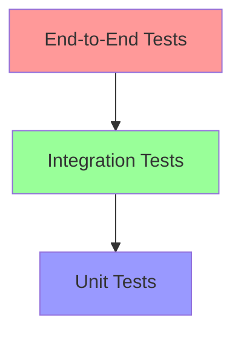

# Testing Strategy

## 1. Testing Pyramid



### 1.1 Unit Tests (Base)
- Test individual components in isolation
- Mock external dependencies
- Fast execution
- High coverage

### 1.2 Integration Tests (Middle)
- Test component interactions
- Use test databases
- Test repository implementations
- Verify external service integrations

### 1.3 E2E Tests (Top)
- Test complete workflows
- Use staging environment
- Test Discord bot commands
- Verify dashboard functionality

## 2. Test Categories

### 2.1 Domain Layer Tests
```python
class TestUserEntity(unittest.TestCase):
    def test_user_creation(self):
        user = User("test_id", "username")
        self.assertEqual(user.username, "username")
    
    def test_invalid_email(self):
        with self.assertRaises(ValueError):
            user = User("test_id", "username", email="invalid")
```

### 2.2 Repository Tests
```python
class TestUserRepository(unittest.IsolatedAsyncioTestCase):
    async def asyncSetUp(self):
        self.session = await create_test_session()
        self.repository = UserRepositoryImpl(self.session)
    
    async def test_save_and_retrieve(self):
        user = User("test_id", "username")
        await self.repository.save(user)
        
        retrieved = await self.repository.get_by_id("test_id")
        self.assertEqual(retrieved.username, "username")
```

### 2.3 Use Case Tests
```python
class TestCreateUserUseCase(unittest.IsolatedAsyncioTestCase):
    def setUp(self):
        self.user_repo = Mock(spec=IUserRepository)
        self.use_case = CreateUserUseCase(self.user_repo)
    
    async def test_create_user(self):
        result = await self.use_case.execute("username", "email@test.com")
        self.user_repo.save.assert_called_once()
        self.assertEqual(result.username, "username")
```

## 3. Testing Tools

### 3.1 Test Framework
- pytest for test execution
- pytest-asyncio for async tests
- pytest-cov for coverage reports

### 3.2 Mocking
```python
@patch('app.shared.infrastructure.discord.client.Client')
async def test_send_message(self, mock_client):
    mock_client.send_message.return_value = "message_id"
    service = DiscordService(mock_client)
    
    result = await service.send_message("channel_id", "Hello")
    mock_client.send_message.assert_called_with("channel_id", "Hello")
```

### 3.3 Fixtures
```python
@pytest.fixture
async def test_db():
    engine = create_async_engine('sqlite:///:memory:')
    async with engine.begin() as conn:
        await conn.run_sync(Base.metadata.create_all)
    
    async_session = sessionmaker(engine, class_=AsyncSession)
    
    yield async_session
    
    async with engine.begin() as conn:
        await conn.run_sync(Base.metadata.drop_all)
```

## 4. CI/CD Integration

### 4.1 GitHub Actions Workflow
```yaml
name: Tests
on: [push, pull_request]

jobs:
  test:
    runs-on: ubuntu-latest
    steps:
      - uses: actions/checkout@v2
      - name: Set up Python
        uses: actions/setup-python@v2
        with:
          python-version: '3.12'
      - name: Install dependencies
        run: |
          python -m pip install --upgrade pip
          pip install -r requirements-dev.txt
      - name: Run tests
        run: |
          pytest --cov=app tests/
```

## 5. Test Documentation

### 5.1 Test Case Template
```python
"""
Test case for user creation use case.

Setup:
- Mock user repository
- Create use case instance

Test Steps:
1. Execute use case with valid data
2. Verify repository called
3. Verify returned user object

Expected Results:
- User created successfully
- Repository save method called once
- Returned user has correct attributes
"""
```

### 5.2 Coverage Goals
- Domain Layer: 95%+ coverage
- Application Layer: 90%+ coverage
- Infrastructure Layer: 85%+ coverage
- Interface Layer: 80%+ coverage 