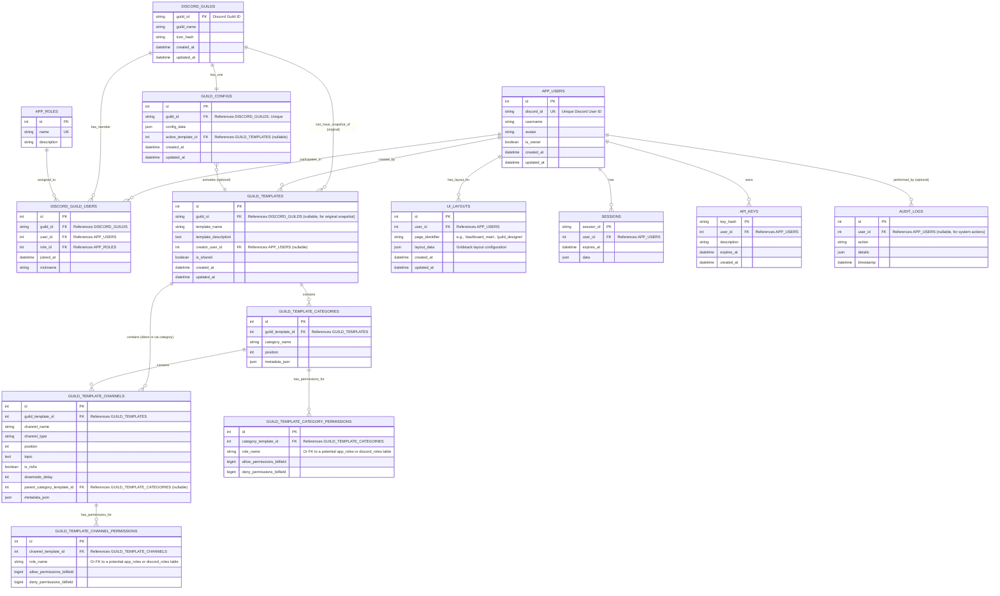

# 4. Database Schema

This document provides an overview of the FoundryCord database schema, designed to support its various features for Discord server management, template design, and user interaction. Understanding the schema is crucial for developers working on features that involve data persistence or retrieval.

## Overview

*   **Type:** PostgreSQL
*   **ORM:** SQLAlchemy (v2.x)
*   **Migration Tool:** Alembic (Migration scripts located in `app/shared/infrastructure/database/migrations`)

## Entity Relationship Diagram (ERD)

Below is an Entity Relationship Diagram illustrating the key tables and their relationships. Due to the number of tables, this ERD focuses on the core entities and their most significant connections. More detailed relationships are described in the "Key Tables" section.

## Key Tables & Domain Meaning

This section describes the purpose of key tables, their domain meaning, and how they relate to DDD concepts like Entities and Aggregates. The table names generally correspond to SQLAlchemy models found in `app/shared/infrastructure/models/`.

*   **`app_users`** (Entity: `AppUser`)
    *   **Domain Meaning:** Represents a user of the FoundryCord application. This user may or may not be linked to a Discord account initially but often is. This table is central to authentication, authorization, and tracking user-specific configurations (like UI layouts) or actions (audit logs, template creation).
    *   Key Columns: `id` (PK), `discord_id` (UK, links to Discord identity), `username`, `is_owner`.
    *   Relationships: Many-to-many with `discord_guilds` via `discord_guild_users`; one-to-many with `sessions`, `api_keys`, `ui_layouts`, `guild_templates` (as creator), `audit_logs`.

*   **`app_roles`** (Entity: `AppRole` - *Assumed, needs model verification*)
    *   **Domain Meaning:** Defines application-specific roles (e.g., 'Admin', 'Moderator', 'Designer') used for FoundryCord\'s internal permission system, distinct from Discord roles.
    *   Key Columns: `id` (PK), `name` (UK).
    *   Relationships: One-to-many with `discord_guild_users` (a user has an app role within a specific guild context for FoundryCord features).

*   **`discord_guilds`** (Entity: `DiscordGuild`)
    *   **Domain Meaning:** Represents a Discord server (guild) that has been onboarded or interacted with by FoundryCord. It acts as a root for guild-specific configurations and data.
    *   Key Columns: `guild_id` (PK, Discord snowflake), `guild_name`.
    *   Relationships: One-to-one with `guild_configs`; one-to-many with `discord_guild_users`, `guild_templates` (for initial snapshots).

*   **`discord_guild_users`** (Association Table)
    *   **Domain Meaning:** Links an `app_user` to a `discord_guild` and assigns them an `app_role` within the context of that guild for FoundryCord. This defines a user\'s specific permissions/role for FoundryCord features related to a particular guild.
    *   Key Columns: `guild_id` (FK), `user_id` (FK), `role_id` (FK).

*   **`guild_configs`** (Entity: `GuildConfig`)
    *   **Domain Meaning:** Stores bot and application configurations specific to a particular `discord_guild`. This includes settings like command prefixes (if any), feature toggles for that guild, and importantly, the `active_template_id` which links to the currently applied guild structure template.
    *   Key Columns: `guild_id` (FK, UK), `config_data` (JSON), `active_template_id` (FK).

*   **`guild_templates`** (Aggregate Root, Entity: `GuildTemplate`)
    *   **Domain Meaning:** This is a central entity representing a saved, reusable Discord server structure. It\'s the core of the Guild Designer feature. A template can be an initial snapshot of an existing guild or a user-designed structure.
    *   **As an Aggregate:** A `GuildTemplate` is the root of an aggregate that includes `GuildTemplateCategories`, `GuildTemplateChannels`, and their respective permission overrides. Changes to the template structure are managed through the `GuildTemplate` root.
    *   Key Columns: `id` (PK), `template_name`, `creator_user_id` (FK), `is_shared`.
    *   Relationships: One-to-many with `guild_template_categories` and `guild_template_channels`.

*   **`guild_template_categories`** (Entity: `GuildTemplateCategory`, part of `GuildTemplate` Aggregate)
    *   **Domain Meaning:** Defines a category within a `guild_template`.
    *   Key Columns: `guild_template_id` (FK), `category_name`, `position`.
    *   Relationships: One-to-many with `guild_template_channels` (as parent), one-to-many with `guild_template_category_permissions`.

*   **`guild_template_channels`** (Entity: `GuildTemplateChannel`, part of `GuildTemplate` Aggregate)
    *   **Domain Meaning:** Defines a channel (text, voice, etc.) within a `guild_template`, optionally parented by a `guild_template_category`.
    *   Key Columns: `guild_template_id` (FK), `channel_name`, `channel_type`, `parent_category_template_id` (FK).
    *   Relationships: One-to-many with `guild_template_channel_permissions`.

*   **`guild_template_category_permissions`** / **`guild_template_channel_permissions`** (Value Objects or Entities, part of `GuildTemplate` Aggregate)
    *   **Domain Meaning:** Define permission overwrites (allow/deny bitfields) for a specific role (identified by `role_name`) on a template category or channel. The `role_name` would ideally map to Discord roles that are expected to exist when the template is applied.

*   **`ui_layouts`** (Entity: `UILayout`)
    *   **Domain Meaning:** Stores user-specific UI layout customizations, primarily for drag-and-drop dashboards (e.g., Gridstack positions for widgets on a specific page).
    *   Key Columns: `user_id` (FK), `page_identifier` (UK with user_id), `layout_data` (JSON).

*   **`sessions`** (Entity: `Session`)
    *   **Domain Meaning:** Manages user sessions for the web application, enabling persistent logins.
    *   Key Columns: `session_id` (PK), `user_id` (FK), `expires_at`.

*   **`api_keys`** (Entity: `ApiKey`)
    *   **Domain Meaning:** Stores API keys that can be issued to users for programmatic access to FoundryCord\'s API.
    *   Key Columns: `key_hash` (PK), `user_id` (FK), `expires_at`.

*   **`audit_logs`** (Entity: `AuditLog`)
    *   **Domain Meaning:** Records significant actions performed by users or the system for auditing and troubleshooting purposes.
    *   Key Columns: `user_id` (FK, nullable), `action`, `details` (JSON).

*(This list is not exhaustive but covers the main entities. Other tables like `security_keys`, `log_entries`, `state_snapshots`, etc., support specific infrastructure or operational concerns.)*

## Relationships & Data Integrity

*   **Foreign Keys:** Enforce referential integrity between related tables (e.g., a `guild_config` must belong to an existing `discord_guild`). `ON DELETE` policies (e.g., `CASCADE`, `SET NULL`) are defined in the SQLAlchemy models to manage cascading effects.
*   **Indexes:** Primary keys are automatically indexed. Foreign keys and frequently queried columns (especially those used in `WHERE` clauses or `JOIN` conditions) are indexed to improve query performance (e.g., `guild_id` on `guild_templates`).
*   **Unique Constraints:** Ensure data uniqueness where required (e.g., a user can only have one layout for a specific page `(user_id, page_identifier)` in `ui_layouts`; `discord_id` in `app_users`).

## Indexing Strategy

*   Primary keys are automatically indexed.
*   Foreign keys are generally indexed (as specified by `index=True` in SQLAlchemy models) to optimize join operations.
*   Specific indexes are created for columns frequently used in lookups or filtering, for example:
    *   `app_users.discord_id`
    *   `guild_templates.guild_id`
    *   `guild_templates.creator_user_id`
    *   `ui_layouts.page_identifier`
    *   `guild_configs.active_template_id`
*   Unique constraints (e.g., on `discord_guild_users (guild_id, user_id)`, `ui_layouts (user_id, page_identifier)`) also create implicit indexes and enforce data integrity. 