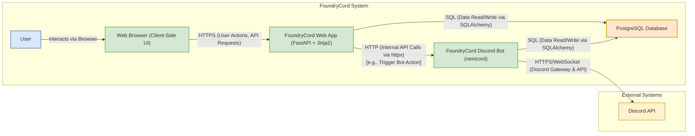

# 1. System Architecture Overview

This document serves as the primary architectural entry point for developers, providing a high-level understanding of FoundryCord's components, their interactions, and the overall design philosophy. It aims to enable new contributors to quickly grasp how the system is structured and how its parts work together.

## Components

Describe the main components of the system and their high-level responsibilities:

*   **Frontend (Web Application):** Resides in `app/web/static` (JS, CSS) and `app/web/templates` (Jinja2), served by the Backend. Provides the user interface for guild configuration, the Guild Template Designer, user management, and administrative tasks. Uses Vanilla JS (ES6+), Bootstrap, Gridstack.js, jsTree, and jQuery.
*   **Backend (REST API):** The core web application located in `app/web`. Built with FastAPI, it serves the frontend, provides RESTful API endpoints (`app/web/interfaces/api/rest/v1/`), handles business logic (`app/web/application/services/`), and manages user sessions and authentication.
*   **Discord Bot (Worker):** The Discord bot application located in `app/bot`. Built with `nextcord`, it interacts with the Discord API, handles slash commands, manages Discord-specific resources (channels, roles), applies template structures, and performs background tasks.
*   **Shared Core (`app/shared`):** A crucial library containing code shared between the Backend (Web App) and the Bot. This design is pivotal for maintaining consistency and reducing redundancy. It includes:
    *   Domain logic and entities (`app/shared/domain`): The heart of the business rules.
    *   Infrastructure components like database models (`app/shared/infrastructure/models`), repositories (`app/shared/infrastructure/repositories`) for data access, database session management, and shared configuration (`app/shared/infrastructure/config`).
    *   Shared application services (e.g., logging, encryption, utility functions) callable by both the web app and the bot.
    By centralizing these common elements, the `Shared Core` ensures that both the web interface and the bot operate on the same data structures and business logic, promoting stability and easier maintenance.
*   **Database:** PostgreSQL. Acts as the central persistence layer storing user data, guild information, template definitions, configurations, UI layouts, logs, and potentially bot state. Managed via SQLAlchemy ORM and Alembic migrations (defined in `app/shared`).

## Interactions

Below is a C4-style Container diagram illustrating how these components interact.



The key interactions are:

*   User's Browser <-> Frontend (HTML/CSS/JS served by Backend)
*   Frontend (JavaScript) <-> Backend API (via HTTP requests)
*   Backend API -> Shared Core (Services, Repositories) -> Database
*   Backend API -> Internal Bot API (via HTTP requests using httpx - for specific, immediate bot actions triggered by the web UI)
*   Discord Bot -> Shared Core (Services, Repositories) -> Database
*   Discord Bot <-> Discord API (Gateway events, REST calls)
*   Discord API -> Discord Bot (Events, Interaction Hooks for commands)

## Key Bounded Contexts (Domain-Driven Design Perspective)

Understanding the system through the lens of [Domain-Driven Design (DDD)](../../1_introduction/glossary.md#ddd-domain-driven-design) can help clarify responsibilities and a [Ubiquitous Language](../../1_introduction/glossary.md#ubiquitous-language). A Bounded Context is a specific responsibility, with an explicit boundary, within which a particular domain model and ubiquitous language apply.

FoundryCord can be viewed as encompassing several key Bounded Contexts:

*   **Guild Configuration & Templating:**
    *   **Focus:** Managing Discord server (guild) structures, including categories, channels, roles, and permissions. This context is central to the **Guild Designer** feature.
    *   **Key Operations:** Creating, reading, updating, deleting, and applying guild templates; modifying individual guild settings.
    *   **Primary Components:** Web UI (Guild Designer), Backend API, Shared Core (template entities, repositories), Discord Bot (for applying changes).

*   **User Account & Access Management:**
    *   **Focus:** User authentication, authorization, profile management, and permissions across the FoundryCord platform (both web and bot).
    *   **Key Operations:** User registration/login, session management, role-based access control (RBAC) for FoundryCord features.
    *   **Primary Components:** Web UI (login, user settings), Backend API (auth endpoints), Shared Core (user models, auth services).

*   **Bot Operations & Discord Interaction:**
    *   **Focus:** Direct interaction with the Discord API, handling slash commands, processing Discord gateway events, and executing bot-specific tasks.
    *   **Key Operations:** Responding to user commands in Discord, managing Discord resources (e.g., creating channels as per a template), real-time event handling.
    *   **Primary Components:** Discord Bot (nextcord client, command handlers, event listeners), Shared Core (for accessing shared data/logic), Discord API.

*   **Dashboarding & Analytics:**
    *   **Focus:** Providing users with customizable views of server activity, bot statistics, and other relevant data through the web interface.
    *   **Key Operations:** Data aggregation, real-time data display, dashboard configuration (layout, widgets).
    *   **Primary Components:** Web UI (Dashboard view, Gridstack.js), Backend API (data endpoints), Shared Core (data retrieval services, potentially aggregation logic).

*   **System Administration & Monitoring:**
    *   **Focus:** Overall health, configuration, and operational monitoring of the FoundryCord system itself (web app, bot, database).
    *   **Key Operations:** Log viewing, system metrics display, core service management.
    *   **Primary Components:** Web UI (admin sections), Backend API (admin/monitoring endpoints), Shared Core (logging services, monitoring collectors).

## Key Responsibilities Flow

*   **Guild Onboarding:** (e.g., User invites bot, bot uses Shared Core/DB to save initial guild info, maybe triggered via Backend API call after web auth).
*   **Template Design:** (e.g., User interacts with Frontend designer, Frontend JS calls Backend API, Backend API uses Shared Core/DB to load/save templates).
*   **Template Activation/Application:** (e.g., User activates via Frontend -> Backend API -> Shared Core updates `active_template_id` in DB. Bot periodically checks or is notified -> Reads active template via Shared Core/DB -> Applies changes to Discord via Discord API).

    ```mermaid
    sequenceDiagram
        actor User
        participant Frontend (Web UI)
        participant BackendAPI (FastAPI)
        participant SharedCore
        participant Database (PostgreSQL)
        participant DiscordBot (Worker)
        participant DiscordAPI

        User->>Frontend (Web UI): Activates a Guild Template
        Frontend (Web UI)->>BackendAPI (FastAPI): POST /api/v1/guilds/{guild_id}/templates/{template_id}/activate
        BackendAPI (FastAPI)->>SharedCore: Get Template(template_id)
        SharedCore->>Database (PostgreSQL): SELECT * FROM templates WHERE id = template_id
        Database (PostgreSQL)-->>SharedCore: Template Data
        SharedCore-->>BackendAPI (FastAPI): Template Data
        BackendAPI (FastAPI)->>SharedCore: UpdateActiveTemplate(guild_id, template_id)
        SharedCore->>Database (PostgreSQL): UPDATE guilds SET active_template_id = template_id WHERE id = guild_id
        Database (PostgreSQL)-->>SharedCore: Success
        SharedCore-->>BackendAPI (FastAPI): Success
        BackendAPI (FastAPI)-->>Frontend (Web UI): HTTP 200 OK
        
        Note over DiscordBot (Worker): Bot periodically checks for active template changes or is notified (e.g., via internal pub/sub or direct API call from Backend - specifics TBD)

        DiscordBot (Worker)->>SharedCore: GetActiveTemplateForGuild(guild_id)
        SharedCore->>Database (PostgreSQL): SELECT * FROM templates WHERE id = (SELECT active_template_id FROM guilds WHERE id = guild_id)
        Database (PostgreSQL)-->>SharedCore: Active Template Data
        SharedCore-->>DiscordBot (Worker): Active Template Data

        DiscordBot (Worker)->>DiscordBot (Worker): Parse Template Data (Channels, Roles, Permissions etc.)
        loop For each Category/Channel in Template
            DiscordBot (Worker)->>DiscordAPI: Create/Update Category/Channel
            DiscordAPI-->>DiscordBot (Worker): Success/Failure
        end
        loop For each Role in Template
            DiscordBot (Worker)->>DiscordAPI: Create/Update Role
            DiscordAPI-->>DiscordBot (Worker): Success/Failure
        end
        loop For each PermissionOverwrite in Template
            DiscordBot (Worker)->>DiscordAPI: Apply Permission Overwrite
            DiscordAPI-->>DiscordBot (Worker): Success/Failure
        end
        DiscordBot (Worker)->>SharedCore: Log Application Status (Optional)
        SharedCore->>Database (PostgreSQL): INSERT INTO audit_logs ... (Optional)
    end
    ``` 