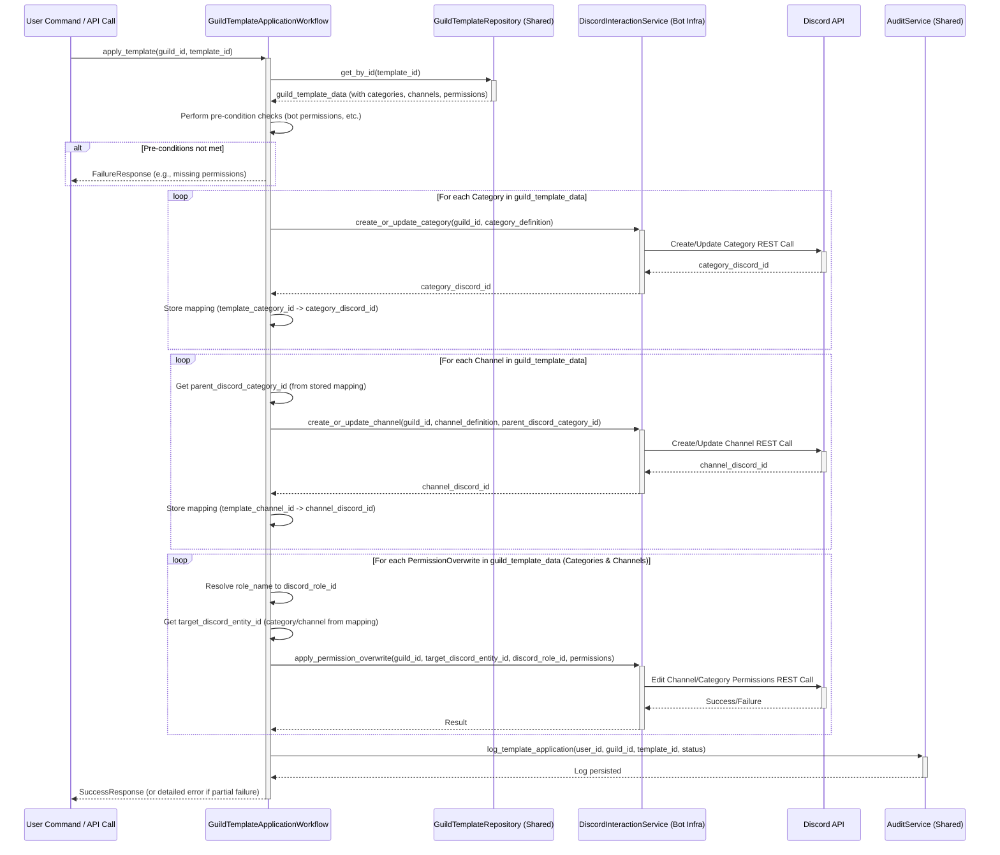

# Bot Internals & Core Components

This document delves into the internal workings of selected core components and workflows within the FoundryCord Bot (`app/bot/`). It builds upon the foundational understanding provided by the [Bot Application Structure](./bot_structure.md) document and aims to clarify responsibilities, collaborations, and complex interactions, particularly from a Domain-Driven Design (DDD) perspective where applicable.

## Key Application Services & Responsibilities

The `app/bot/application/services/` directory houses various services responsible for specific business functionalities. These services often orchestrate domain logic (from `app/shared/domain/`) and interact with repositories for data persistence.

### 1. Dashboard Lifecycle Service (`app/bot/application/services/dashboard/dashboard_lifecycle_service.py`)
*   **Responsibility:** Manages the lifecycle of bot-driven interactive dashboards displayed in Discord. This includes initializing dashboards, handling component loading (via `ComponentLoaderService`), processing user interactions from dashboard components (buttons, selectors), and refreshing dashboard data.
*   **Collaborators:**
    *   `ComponentLoaderService`: To load definitions and states of dashboard components.
    *   `DashboardDataService`: To fetch or compute data required by various dashboard widgets.
    *   `DashboardRepository` (from `app/shared/`): To persist dashboard configurations or states.
    *   `MessageSender` (from `app/bot/infrastructure/messaging/`): To send/update Discord messages representing the dashboards.
    *   Various dashboard component handlers/factories.
*   **Domain Relevance:** Enables the dynamic and interactive monitoring and control features provided to users via Discord embeds and UI elements.

### 2. System Monitoring Service (`app/bot/application/services/monitoring/system_monitoring.py`)
*   **Responsibility:** Collects and provides system metrics and status information. This might include bot performance metrics, host system health (CPU, memory, disk), and status of external services the bot relies on or monitors.
*   **Collaborators:**
    *   Various metric collectors (e.g., from `app/bot/infrastructure/monitoring/collectors/system/` and `app/bot/infrastructure/state/collectors/`).
    *   `SystemMetricsService` (potentially for aggregation or specific metric retrieval).
    *   `MonitoringRepository` (from `app/shared/`): If historical metrics are stored.
*   **Domain Relevance:** Supports the bot\'s operational monitoring capabilities, often feeding data into administrative dashboards or status commands.

### 3. Configuration Service (`app/bot/application/services/config/config_service.py`)
*   **Responsibility:** Provides a unified interface for accessing bot-specific and shared configurations. It consolidates settings from environment variables, configuration files, and potentially the database.
*   **Collaborators:**
    *   Environment variable loaders (e.g., `python-dotenv`).
    *   Configuration file parsers/modules (from `app/bot/infrastructure/config/` and `app/shared/infrastructure/config/`).
    *   Potentially `ConfigRepository` (from `app/shared/`) if some configurations are dynamic and stored in the DB.
*   **Domain Relevance:** Ensures consistent and manageable configuration access throughout the bot application, affecting feature availability, behavior, and external service integrations.

## Core Workflows & Interactions

Workflows (`app/bot/application/workflows/`) represent more complex, multi-step processes. Below is an example of a key workflow.

### Guild Template Application Workflow

This workflow is responsible for applying a stored Guild Template to a target Discord server, creating categories, channels, and setting permissions as defined in the template.

*   **Trigger:** Typically invoked by a user command (e.g., via `GuildTemplateCommands`) or an internal API call from the web application after a user activates a template in the Guild Designer.
*   **Key Steps & Collaborators:** (See sequence diagram below for detailed interactions)
    1.  **Retrieve Template:** Fetches the specified `GuildTemplate` entity (and its associated categories, channels, permissions) from the database using `GuildTemplateRepository`.
    2.  **Pre-condition Checks:** Verifies bot permissions on the target guild, ensures the template is valid, and potentially checks for existing structures to avoid conflicts (or implement a merge/overwrite strategy).
    3.  **Category Creation/Update:** Iterates through `GuildTemplateCategory` definitions.
        *   For each, calls Discord API (via a wrapper like `DiscordQueryService` or direct `nextcord` calls) to create or update the category on the guild.
        *   Stores mapping of template category ID to actual Discord category ID.
    4.  **Channel Creation/Update:** Iterates through `GuildTemplateChannel` definitions.
        *   For each, determines parent category (using stored mapping).
        *   Calls Discord API to create or update the channel under the correct category.
        *   Stores mapping of template channel ID to actual Discord channel ID.
    5.  **Permission Application:** Iterates through `GuildTemplateCategoryPermission` and `GuildTemplateChannelPermission` definitions.
        *   For each, resolves role names to actual Discord roles on the guild.
        *   Calls Discord API to apply permission overwrites to the corresponding created categories/channels.
    6.  **Logging & Feedback:** Logs the progress and outcome of the application process. Provides feedback to the user or calling system.
*   **Domain Relevance:** This is a core feature of FoundryCord, enabling the automated setup and standardization of Discord server structures.

**Sequence Diagram: Guild Template Application**



## Critical Algorithms & Logic

*(This section will be populated as specific complex algorithms within the bot are identified for detailed explanation. Examples might include complex permission merging logic, sophisticated data aggregation for dashboards, or resource allocation strategies if applicable.)*

```tree

bot
├── application
│   ├── decorators
│   │   ├── auth.py
│   │   └── respond.py
│   ├── process
│   │   ├── cleanup_dm_task.py
│   │   ├── cleanup_task.py
│   │   └── security_tasks.py
│   └── services
│       ├── auth
│       │   ├── __init__.py
│       │   └── OLD.py
│       ├── bot_control_service.py
│       ├── category
│       │   ├── category_builder.py
│       │   ├── category_setup_service.py
│       │   └── __init__.py
│       ├── channel
│       │   ├── channel_builder.py
│       │   ├── channel_factory.py
│       │   ├── channel_setup_service.py
│       │   ├── game_server_channel_service.py
│       │   └── __init__.py
│       ├── config
│       │   ├── config_service.py
│       │   └── __init__.py
│       ├── dashboard
│       │   ├── component_loader_service.py
│       │   ├── dashboard_builder.py
│       │   ├── dashboard_builder_service.py
│       │   ├── dashboard_lifecycle_service.py
│       │   ├── dashboard_repository.py
│       │   ├── dashboard_service.py
│       │   └── __init__.py
│       ├── discord
│       │   ├── discord_query_service.py
│       │   └── __init__.py
│       ├── __init__.py
│       ├── monitoring
│       │   └── system_monitoring.py
│       ├── project_management
│       │   ├── __init__.py
│       │   ├── project_service.py
│       │   └── task_service.py
│       ├── system_metrics
│       │   ├── __init__.py
│       │   └── system_metrics_service.py
│       └── wireguard
│           ├── __init__.py
│           └── wireguard_service.py
├── config
├── core
│   ├── checks.py
│   ├── extensions.py
│   ├── __init__.py
│   ├── lifecycle_manager.py
│   ├── main.py
│   ├── shutdown_handler.py
│   ├── workflow_manager.py
│   └── workflows
│       ├── base_workflow.py
│       ├── bot_permission_workflow.py
│       ├── category_workflow.py
│       ├── channel_workflow.py
│       ├── dashboard_workflow.py
│       ├── database_workflow.py
│       ├── guild
│       │   ├── approval.py
│       │   ├── check_structure.py
│       │   ├── initialization.py
│       │   ├── __init__.py
│       │   ├── state.py
│       │   ├── sync.py
│       │   └── template_application.py
│       ├── guild_template_workflow.py
│       ├── __init__.py
│       ├── overview_workflow.py
│       ├── service_manager.py
│       ├── service_workflow.py
│       ├── slash_commands_workflow.py
│       ├── task_workflow.py
│       ├── user_workflow.py
│       └── webinterface_workflow.py
├── database
│   └── wireguard
├── infrastructure
│   ├── component
│   │   ├── factory.py
│   │   ├── __init__.py
│   │   └── registry.py
│   ├── config
│   │   ├── category_config.py
│   │   ├── channel_config.py
│   │   ├── command_config.py
│   │   ├── constants
│   │   │   ├── category_constants.py
│   │   │   ├── channel_constants.py
│   │   │   ├── dashboard_constants.py
│   │   │   ├── role_constants.py
│   │   │   └── user_config.py
│   │   ├── dashboard_config.py
│   │   ├── feature_flags.py
│   │   ├── __init__.py
│   │   ├── service_config.py
│   │   ├── services
│   │   │   └── dashboard_config.py
│   │   └── task_config.py
│   ├── dashboards
│   │   ├── dashboard_registry.py
│   │   └── __init__.py
│   ├── data
│   │   ├── data_source_registry.py
│   │   └── __init__.py
│   ├── data_sources
│   │   └── system_metrics_source.py
│   ├── discord
│   │   ├── category_setup_service.py
│   │   ├── command_sync_service.py
│   │   ├── dashboard_setup_service.py
│   │   ├── game_server_channels.py
│   │   ├── role_mapper.py
│   │   └── setup_discord_channels.py
│   ├── factories
│   │   ├── base
│   │   │   ├── base_factory.py
│   │   │   └── __init__.py
│   │   ├── component_factory.py
│   │   ├── component_registry_factory.py
│   │   ├── component_registry.py
│   │   ├── composite
│   │   │   ├── bot_factory.py
│   │   │   ├── __init__.py
│   │   │   ├── service_factory.py
│   │   │   └── workflow_factory.py
│   │   ├── data_source_registry_factory.py
│   │   ├── data_source_registry.py
│   │   ├── discord
│   │   │   ├── channel_factory.py
│   │   │   ├── __init__.py
│   │   │   └── thread_factory.py
│   │   ├── __init__.py
│   │   ├── service
│   │   │   ├── __init__.py
│   │   │   ├── service_factory.py
│   │   │   ├── service_resolver.py
│   │   │   └── task_factory.py
│   │   ├── service_factory.py
│   │   └── task_factory.py
│   ├── __init__.py
│   ├── internal_api
│   │   ├── routes.py
│   │   └── server.py
│   ├── managers
│   │   └── dashboard_manager.py
│   ├── messaging
│   │   ├── chunk_manager.py
│   │   ├── http_client.py
│   │   ├── message_sender.py
│   │   └── response_mode.py
│   ├── monitoring
│   │   ├── checkers
│   │   │   ├── docker_utils.py
│   │   │   ├── game_service_checker.py
│   │   │   ├── __init__.py
│   │   │   ├── port_checker.py
│   │   │   └── web_service_checker.py
│   │   ├── collectors
│   │   │   ├── game_servers
│   │   │   │   ├── __init__.py
│   │   │   │   └── minecraft_server_collector_impl.py
│   │   │   ├── service
│   │   │   │   ├── components
│   │   │   │   │   ├── base.py
│   │   │   │   │   ├── docker.py
│   │   │   │   │   ├── __init__.py
│   │   │   │   │   ├── security.py
│   │   │   │   │   └── services.py
│   │   │   │   ├── config
│   │   │   │   │   ├── game_services.py
│   │   │   │   │   ├── __init__.py
│   │   │   │   │   └── web_services.py
│   │   │   │   ├── impl.py
│   │   │   │   └── __init__.py
│   │   │   └── system
│   │   │       ├── components
│   │   │       │   ├── base.py
│   │   │       │   ├── hardware
│   │   │       │   │   ├── cpu.py
│   │   │       │   │   ├── gpu.py
│   │   │       │   │   ├── __init__.py
│   │   │       │   │   ├── memory.py
│   │   │       │   │   ├── network.py
│   │   │       │   │   ├── power.py
│   │   │       │   │   ├── sensors.py
│   │   │       │   │   ├── speed_test.py
│   │   │       │   │   └── system.py
│   │   │       │   ├── __init__.py
│   │   │       │   ├── network.py
│   │   │       │   ├── storage.py
│   │   │       │   └── system.py
│   │   │       ├── impl.py
│   │   │       └── __init__.py
│   │   └── __init__.py
│   ├── rate_limiting
│   │   ├── __init__.py
│   │   ├── rate_limiting_middleware.py
│   │   └── rate_limiting_service.py
│   └── state
│       ├── bot_state_collectors.py
│       └── collectors
│           ├── basic_info.py
│           ├── cog_status.py
│           ├── database_status.py
│           ├── discord_api.py
│           ├── listeners.py
│           └── performance.py
├── __init__.py
├── interfaces
│   ├── bot.py
│   ├── commands
│   │   ├── auth
│   │   │   ├── auth_commands.py
│   │   │   └── __init__.py
│   │   ├── dashboard
│   │   │   └── dashboard_command.py
│   │   ├── monitoring
│   │   │   ├── __init__.py
│   │   │   └── system_monitoring_commands.py
│   │   ├── tracker
│   │   │   └── project_commands.py
│   │   ├── utils
│   │   │   └── clean
│   │   │       └── cleanup_commands.py
│   │   └── wireguard
│   │       ├── config_commands.py
│   │       ├── __init__.py
│   │       ├── qr_commands.py
│   │       ├── README.md
│   │       └── utils.py
│   └── dashboards
│       ├── components
│       │   ├── base_component.py
│       │   ├── channels.py
│       │   ├── common
│       │   │   ├── buttons
│       │   │   │   ├── __init__.py
│       │   │   │   └── refresh_button.py
│       │   │   └── embeds
│       │   │       ├── dashboard_embed.py
│       │   │       ├── error_embed.py
│       │   │       └── __init__.py
│       │   ├── factories
│       │   │   ├── base_dashboard_factory.py
│       │   │   ├── base_factory.py
│       │   │   ├── button_factory.py
│       │   │   ├── dashboard_factory.py
│       │   │   ├── embed_factory.py
│       │   │   ├── __init__.py
│       │   │   ├── menu_factory.py
│       │   │   ├── message_factory.py
│       │   │   ├── modal_factory.py
│       │   │   ├── new_factory.py
│       │   │   ├── ui_component_factory.py
│       │   │   └── view_factory.py
│       │   ├── __init__.py
│       │   └── ui
│       │       ├── __init__.py
│       │       ├── mini_graph.py
│       │       └── table_builder.py
│       ├── controller
│       │   ├── base_dashboard.py
│       │   ├── dynamic_dashboard.py
│       │   ├── __init__.py
│       │   ├── template_dashboard.py
│       │   └── universal_dashboard.py
│       └── __init__.py
├── requirements.txt
├── state_collectors.py
└── utils
    └── vars.py
```
