# PostgreSQL Database Initialization Workflow

## 🔑 Two-Phase Initialization Process

### 🐳 Container Initialization (init-db.sh) [CRITICAL]
- ✅ Runs during Docker container startup
- ✅ Creates database users and sets permissions
- ✅ Generates secure credentials
- ✅ Creates core tables and extensions
- ✅ Runs initial SQL scripts
- ✅ Handles development vs production credential storage
- ✅ Stores credentials in security_keys table

### 🐍 Application Initialization (Python) [ESSENTIAL]
- ✅ Verifies database connectivity
- ✅ Checks for required tables
- ✅ Handles schema migrations
- ✅ Manages runtime database connections
- ✅ Implements security features

## 🛠️ Container Initialization Details [CORE FUNCTIONALITY]

### 🔐 Credential Management [SECURITY CRITICAL]
- ✅ Auto-generates secure passwords if not provided
- ✅ Stores credentials in security_keys table
- ✅ Saves to .env.credentials in development mode
- ⚠️ Requires proper environment variable configuration
- ⚠️ Must handle both development and production modes

### 🗄️ Database Setup [ESSENTIAL INFRASTRUCTURE]
- ✅ Creates application user with proper permissions
- ✅ Creates core tables including security_keys
- ✅ Adds PostgreSQL extensions (pgcrypto, uuid-ossp)
- ✅ Executes init-tables.sql
- ⚠️ Must maintain idempotency for container restarts

## 🚀 Application Initialization Details [RUNTIME CRITICAL]

### 🔌 Connection Management [NETWORK ESSENTIAL]
- ✅ Uses async SQLAlchemy engine
- ✅ Implements retry logic with exponential backoff
- ✅ Verifies environment variables
- ⚠️ Must handle network failures gracefully
- ⚠️ Requires proper connection pooling configuration

### 🗂️ Schema Verification [DATA INTEGRITY]
- ✅ Checks for critical tables (security_keys, users, etc.)
- ✅ Creates missing security tables if needed
- ✅ Handles schema migrations via Alembic
- ⚠️ Must maintain backward compatibility
- ⚠️ Requires proper migration rollback capabilities

### 🔒 Security Features [CRITICAL]
- ✅ Uses DatabaseCredentialManager
- ✅ Implements secure credential storage with encryption
- ✅ Validates database configuration
- ⚠️ Must handle credential rotation
- ⚠️ Requires proper access control enforcement

## 📊 Workflow Diagram [VISUAL OVERVIEW]

### 🐳 Container Initialization Flow
```
┌──────────────────────┐
│ Container Startup    │
│ (init-db.sh)         │
├──────────────────────┤
│ 1. Create Users      │
│ 2. Generate Creds    │
│ 3. Create Tables     │
│ 4. Run SQL Scripts   │
└──────────┬───────────┘
           │
           ▼
```

### 🐍 Application Initialization Flow
```
┌──────────────────────┐
│ Application Startup  │
│ (Python Code)        │
├──────────────────────┤
│ 1. Verify Connection │
│ 2. Check Tables      │
│ 3. Handle Migrations │
│ 4. Manage Connections│
└──────────┬───────────┘
           │
           ▼
```

### 🗄️ Database Interaction
```
┌────────────────────────────────────────────────────┐
│                PostgreSQL Database                 │
│                                                    │
│  ✅ Handles container initialization requests      │
│  ✅ Processes application runtime queries          │
│  ⚠️ Must maintain data consistency                 │
│  ⚠️ Requires proper transaction management         │
└────────────────────────────────────────────────────┘
```

### 🔄 Full Workflow Integration
```
┌──────────────────────┐       ┌──────────────────────┐
│ Container Startup    │       │ Application Startup  │
│ (init-db.sh)         │       │ (Python Code)        │
├──────────────────────┤       ├──────────────────────┤
│ 1. Create Users      │       │ 1. Verify Connection │
│ 2. Generate Creds    │       │ 2. Check Tables      │
│ 3. Create Tables     │       │ 3. Handle Migrations │
│ 4. Run SQL Scripts   │       │ 4. Manage Connections│
└──────────┬───────────┘       └──────────┬───────────┘
           │                              │
           ▼                              ▼
┌────────────────────────────────────────────────────┐
│                PostgreSQL Database                 │
└────────────────────────────────────────────────────┘
```

## 🛠️ Refactoring Plan for Improved Initialization [CORE IMPROVEMENTS]

### 1. 🔌 Connection Management Refactor [NETWORK CRITICAL]
- ✅ Create single DatabaseConnectionManager class
- ✅ Consolidate all connection logic
- ✅ Implement consistent retry policies
- ✅ Standardize environment variable handling
- ⚠️ Must handle connection pooling efficiently
- ⚠️ Requires proper connection cleanup

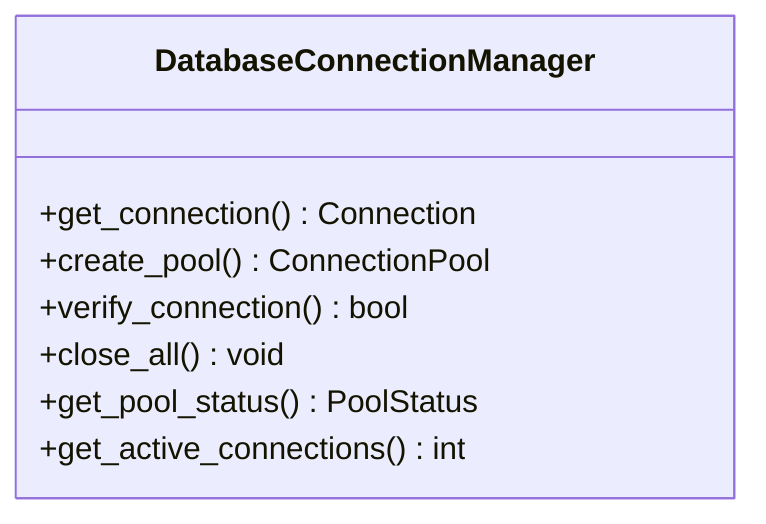

### 2. 🏭 Session Factory Unification [SESSION MANAGEMENT]
- ✅ Implement SessionFactory interface
- ✅ Create single implementation
- ✅ Standardize session creation
- ✅ Add session lifecycle management
- ⚠️ Must handle session cleanup
- ⚠️ Requires proper transaction management

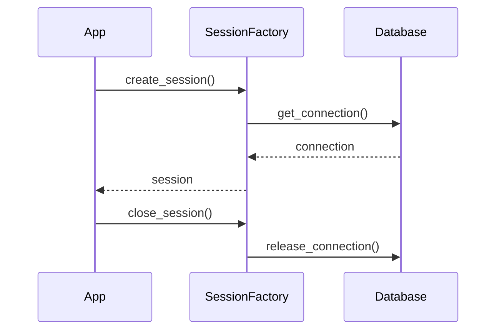

### 3. 🗂️ Table Initialization Standardization [DATA INTEGRITY]
- ✅ Create TableInitializer service
- ✅ Implement consistent table creation
- ✅ Handle both migration and direct creation
- ✅ Add schema verification
- ⚠️ Must maintain backward compatibility
- ⚠️ Requires proper migration rollback

```python
class TableInitializer:
    def __init__(self, connection):
        self.connection = connection
        
    async def initialize_tables(self):
        """Standardized table initialization"""
        await self._verify_core_tables()
        await self._run_migrations()
        await self._verify_schema()
        await self._create_missing_tables()
        await self._validate_constraints()
```

### 4. 🚨 Error Handling Improvements [RESILIENCE]
- ✅ Create DatabaseErrorHandler
- ✅ Standardize error codes
- ✅ Implement consistent logging
- ✅ Add recovery mechanisms
- ⚠️ Must handle transient failures
- ⚠️ Requires proper error classification

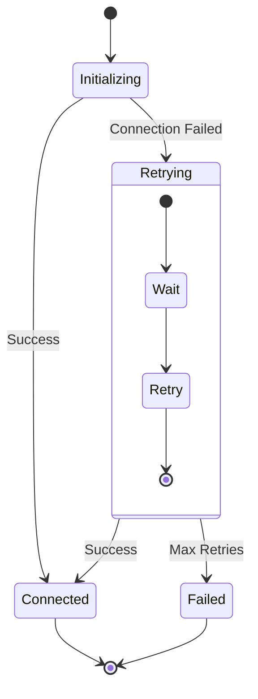

### 5. 🏗️ Shared Structure Refactor [ARCHITECTURE]
- ✅ Consolidate database-related code
- ✅ Create clear domain boundaries
- ✅ Implement proper DDD patterns
- ✅ Improve module organization
- ⚠️ Must maintain existing functionality
- ⚠️ Requires careful dependency management

```
shared/
├── database/
│   ├── connection/
│   ├── migrations/
│   ├── models/
│   ├── repositories/
│   └── services/
└── domain/
    ├── core/
    ├── auth/
    ├── logging/
    └── monitoring/
```

## 🗺️ Implementation Roadmap [DEVELOPMENT PLAN]

### 🚩 Phase 5: Cross-Component Integration [BOT-WEB UNIFICATION]
- ✅ Create Shared Database Access Layer
  - Consolidate database connection logic
  - Implement unified session management
  - Add cross-component transaction support
- ✅ Implement Shared Repository Pattern
  - Create base repository implementations
  - Add transaction boundary management
  - Implement consistent error handling
- ✅ Update Bot/Web Integration Points
  - Migrate existing database access
  - Update tests and documentation
  - Verify backward compatibility

### 🚩 Phase 8: Shared Structure Optimization [DDD REFACTOR]
- ✅ Consolidate Shared Database Access
  - Create unified database connection pool
  - Implement cross-component session management
  - Add transaction boundary enforcement
- ✅ Optimize Repository Layer
  - Create base repository implementations
  - Add caching strategies
  - Implement query optimization
- ✅ Improve Domain Boundaries
  - Create clear bounded contexts
  - Implement proper aggregate roots
  - Add domain event handling
- ✅ Update Infrastructure
  - Migrate to optimized structure
  - Update dependency injection
  - Verify performance improvements

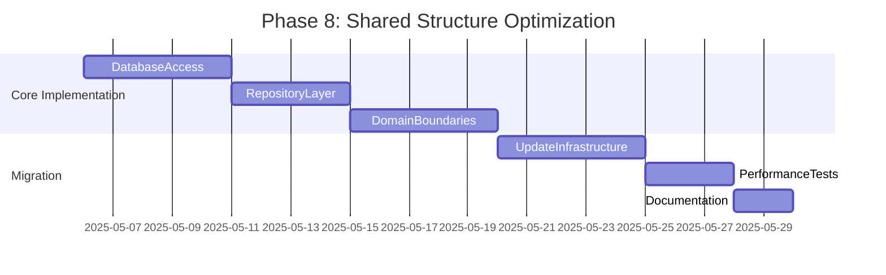

### Proposed Shared Structure
```
shared/
├── database/
│   ├── connection/
│   │   ├── connection_manager.py
│   │   ├── session_factory.py
│   │   └── transaction_manager.py
│   ├── migrations/
│   │   ├── alembic/
│   │   └── migration_service.py
│   ├── models/
│   │   ├── auth/
│   │   ├── core/
│   │   ├── dashboards/
│   │   └── monitoring/
│   ├── repositories/
│   │   ├── base_repository.py
│   │   ├── auth/
│   │   ├── dashboards/
│   │   └── monitoring/
│   └── services/
│       ├── database_service.py
│       ├── migration_service.py
│       └── transaction_service.py
└── domain/
    ├── core/
    │   ├── entities/
    │   ├── events/
    │   ├── repositories/
    │   └── services/
    ├── auth/
    │   ├── entities/
    │   ├── events/
    │   ├── repositories/
    │   └── services/
    ├── logging/
    │   ├── entities/
    │   ├── events/
    │   ├── repositories/
    │   └── services/
    └── monitoring/
        ├── entities/
        ├── events/
        ├── repositories/
        └── services/
```

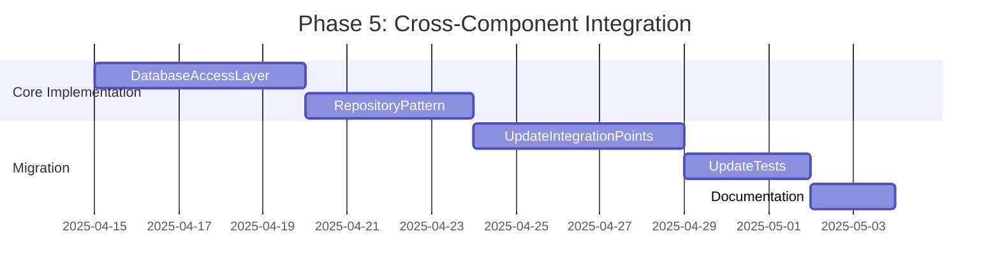

### 🚩 Phase 6: Database Optimization [PERFORMANCE]
- ✅ Implement Query Optimization
  - Add query profiling
  - Implement caching strategies
  - Add connection pooling
- ✅ Add Monitoring
  - Implement database health checks
  - Add performance metrics
  - Create alerting system
- ✅ Update Infrastructure
  - Migrate to optimized queries
  - Update connection management
  - Verify performance improvements

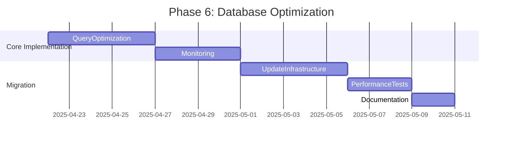

### 🚩 Phase 7: Security Enhancements [DATA PROTECTION]
- ✅ Implement Encryption
  - Add field-level encryption
  - Implement secure credential storage
  - Add key rotation
- ✅ Add Access Control
  - Implement row-level security
  - Add audit logging
  - Implement data masking
- ✅ Update Security Policies
  - Migrate to secure access patterns
  - Update tests and documentation
  - Verify security improvements

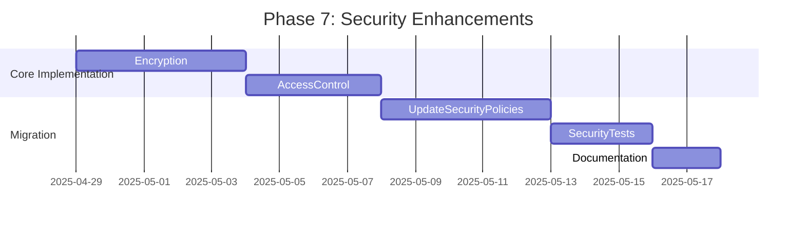

### 🚩 Phase 1: Connection & Session Refactor [NETWORK FOUNDATION]
- ✅ Implement DatabaseConnectionManager
  - Create connection pooling logic
  - Add connection health checks
  - Implement retry mechanisms
- ✅ Create SessionFactory
  - Standardize session creation
  - Add session lifecycle management
  - Implement transaction handling
- ✅ Update all consumers
  - Migrate existing connection logic
  - Update tests and documentation
  - Verify backward compatibility

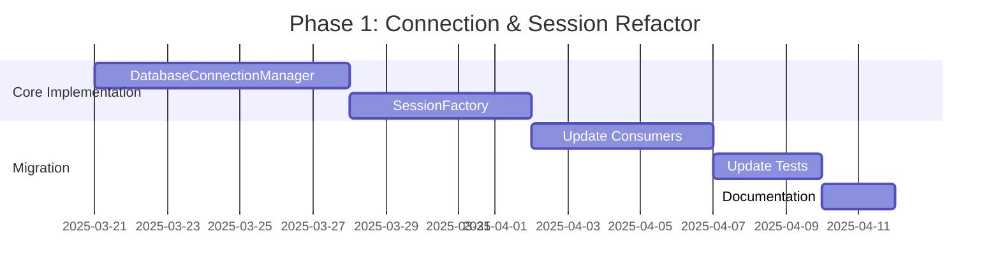

### 🚩 Phase 2: Table Initialization [DATA INTEGRITY]
- ✅ Implement TableInitializer
  - Create table verification logic
  - Add migration handling
  - Implement schema validation
- ✅ Migrate existing code
  - Update initialization scripts
  - Refactor table creation logic
  - Verify data consistency
- ✅ Add schema verification
  - Create schema validation rules
  - Implement constraint checking
  - Add automated schema tests

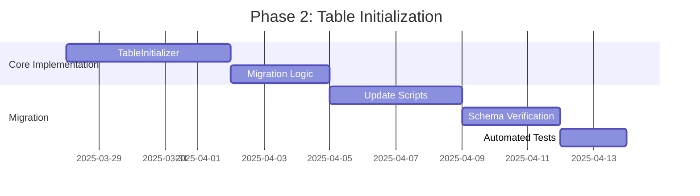

### 🚩 Phase 3: Error Handling [RESILIENCE]
- ✅ Create DatabaseErrorHandler
  - Implement error classification
  - Add error recovery mechanisms
  - Create standardized error codes
- ✅ Standardize error codes
  - Define error categories
  - Create error code mapping
  - Implement error translation
- ✅ Update error handling
  - Migrate existing error handling
  - Add context to error messages
  - Implement error logging

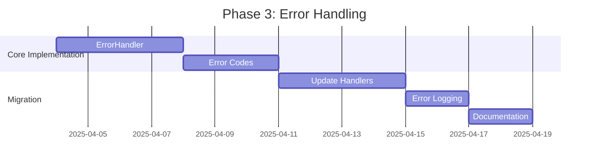

### 🚩 Phase 4: Structure Refactor [ARCHITECTURE]
- ✅ Reorganize shared structure
  - Create clear domain boundaries
  - Implement proper DDD patterns
  - Improve module organization
- ✅ Implement DDD patterns
  - Create bounded contexts
  - Implement domain services
  - Add repository pattern
- ✅ Update imports and references
  - Migrate existing code
  - Update dependency injection
  - Verify backward compatibility

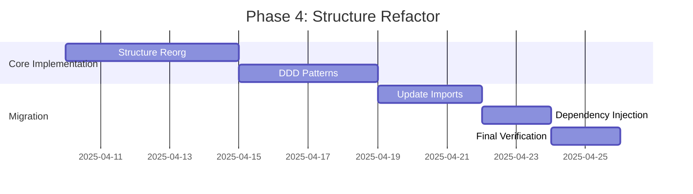


 WHAT WE SHOULD do , future shared/app strucure DDD Patter:
.
├── application
│   ├── logging
│   │   ├── formatters.py
│   │   └── log_config.py
│   └── tasks
│       └── schedule_key_rotation.py
├── bot
│   ├── application
│   ├── domain
│   └── infrastructure
│       └── entrypoint.py
├── config
│   └── default_config.py
├── domain
│   ├── auth
│   │   ├── __init__.py
│   │   ├── models
│   │   │   ├── __init__.py
│   │   │   ├── permission.py
│   │   │   ├── role.py
│   │   │   └── user.py
│   │   ├── policies
│   │   │   ├── authorization_policies.py
│   │   │   └── __init__.py
│   │   ├── repositories
│   │   │   └── user_repository.py
│   │   └── services
│   │       ├── authentication_service.py
│   │       ├── authorization_service.py
│   │       ├── __init__.py
│   │       └── permission_service.py
│   ├── logging
│   │   ├── entities
│   │   │   ├── __init__.py
│   │   │   └── log_entry.py
│   │   ├── repositories
│   │   │   ├── __init__.py
│   │   │   └── log_repository.py
│   │   └── services
│   │       ├── __init__.py
│   │       └── logging_service.py
│   ├── models
│   ├── repositories
│   └── services
│       └── __init__.py
├── infrastructure
│   ├── config
│   │   ├── env_config.py
│   │   ├── env_loader.py
│   │   ├── env_manager.py
│   │   └── __init__.py
│   ├── database
│   │   ├── api.py
│   │   ├── bootstrapper.py
│   │   ├── config
│   │   │   └── user_config.py
│   │   ├── constants
│   │   │   ├── category_constants.py
│   │   │   ├── channel_constants.py
│   │   │   ├── dashboard_constants.py
│   │   │   ├── __init__.py
│   │   │   ├── role_constants.py
│   │   │   └── user_constants.py
│   │   ├── core
│   │   │   ├── config.py
│   │   │   ├── connection.py
│   │   │   ├── credentials.py
│   │   │   └── __init__.py
│   │   ├── __init__.py
│   │   ├── migrations
│   │   │   ├── alembic
│   │   │   │   ├── alembic.ini
│   │   │   │   ├── env.py
│   │   │   │   └── versions
│   │   │   │       ├── 001_create_tables.py
│   │   │   │       ├── 002_seed_categories.py
│   │   │   │       ├── 003_seed_channels.py
│   │   │   │       ├── 004_seed_dashboards.py
│   │   │   │       └── 005_create_users.py
│   │   │   ├── categories
│   │   │   ├── channels
│   │   │   ├── create_config_table.py
│   │   │   ├── init_db.py
│   │   │   ├── __init__.py
│   │   │   ├── init_variables.py
│   │   │   ├── migration_service.py
│   │   │   ├── README.md
│   │   │   ├── script.py.mako
│   │   │   └── wait_for_postgres.py
│   │   ├── models
│   │   │   ├── auth
│   │   │   │   ├── __init__.py
│   │   │   │   ├── rate_limit.py
│   │   │   │   ├── session.py
│   │   │   │   └── user.py
│   │   │   ├── base.py
│   │   │   ├── core
│   │   │   │   ├── audit_log.py
│   │   │   │   ├── config.py
│   │   │   │   ├── __init__.py
│   │   │   │   └── log_entry.py
│   │   │   ├── dashboards
│   │   │   │   ├── component_layout.py
│   │   │   │   ├── content_template.py
│   │   │   │   ├── dashboard_component.py
│   │   │   │   ├── dashboard_message.py
│   │   │   │   ├── dashboard.py
│   │   │   │   └── __init__.py
│   │   │   ├── discord
│   │   │   │   ├── auto_thread_channel.py
│   │   │   │   ├── category_mapping.py
│   │   │   │   ├── channel_mapping.py
│   │   │   │   ├── guild.py
│   │   │   │   ├── __init__.py
│   │   │   │   └── message.py
│   │   │   ├── __init__.py
│   │   │   ├── monitoring
│   │   │   │   ├── alert.py
│   │   │   │   ├── __init__.py
│   │   │   │   └── metric.py
│   │   │   └── project
│   │   │       ├── __init__.py
│   │   │       ├── project.py
│   │   │       ├── tables.py
│   │   │       └── task.py
│   │   ├── repositories
│   │   │   ├── auditlog_repository_impl.py
│   │   │   ├── base_repository.py
│   │   │   ├── category_repository_impl.py
│   │   │   ├── dashboard_repository_impl.py
│   │   │   ├── __init__.py
│   │   │   ├── key_repository_impl.py
│   │   │   ├── monitoring_repository_impl.py
│   │   │   ├── new_dashboard_repository_impl.py
│   │   │   ├── project_repository_impl.py
│   │   │   ├── ratelimit_repository_impl.py
│   │   │   ├── session_repository_impl.py
│   │   │   ├── task_repository_impl.py
│   │   │   └── user_repository_impl.py
│   │   ├── seeds
│   │   │   ├── categories
│   │   │   ├── channels
│   │   │   └── dashboards
│   │   │       ├── common
│   │   │       │   ├── buttons.py
│   │   │       │   ├── embeds.py
│   │   │       │   ├── __init__.py
│   │   │       │   ├── messages.py
│   │   │       │   ├── modals.py
│   │   │       │   ├── selectors.py
│   │   │       │   └── views.py
│   │   │       ├── gamehub
│   │   │       │   ├── buttons.py
│   │   │       │   ├── embeds.py
│   │   │       │   ├── __init__.py
│   │   │       │   ├── messages.py
│   │   │       │   ├── modals.py
│   │   │       │   ├── selectors.py
│   │   │       │   └── views.py
│   │   │       ├── monitoring
│   │   │       │   ├── buttons.py
│   │   │       │   ├── embeds.py
│   │   │       │   ├── __init__.py
│   │   │       │   ├── messages.py
│   │   │       │   ├── modals.py
│   │   │       │   ├── selectors.py
│   │   │       │   └── views.py
│   │   │       ├── project
│   │   │       │   ├── buttons.py
│   │   │       │   ├── embeds.py
│   │   │       │   ├── __init__.py
│   │   │       │   ├── messages.py
│   │   │       │   ├── modals.py
│   │   │       │   ├── selectors.py
│   │   │       │   └── views.py
│   │   │       └── welcome
│   │   │           ├── buttons.py
│   │   │           ├── embeds.py
│   │   │           ├── __init__.py
│   │   │           ├── messages.py
│   │   │           ├── modals.py
│   │   │           ├── selectors.py
│   │   │           └── views.py
│   │   ├── service.py
│   │   └── session
│   │       ├── context.py
│   │       ├── factory.py
│   │       └── __init__.py
│   ├── encryption
│   │   ├── encryption_commands.py
│   │   ├── encryption_service.py
│   │   ├── __init__.py
│   │   └── key_management_service.py
│   ├── __init__.py
│   ├── logging
│   │   ├── handlers
│   │   │   ├── db_handler.py
│   │   │   └── __init__.py
│   │   ├── __init__.py
│   │   ├── repositories
│   │   │   ├── __init__.py
│   │   │   └── log_repository_impl.py
│   │   └── services
│   │       ├── base_logging_service.py
│   │       ├── bot_logging_service.py
│   │       ├── __init__.py
│   │       └── web_logging_service.py
│   ├── security
│   │   ├── __init__.py
│   │   ├── security_bootstrapper.py
│   │   └── security_service.py
│   └── startup
│       ├── bootstrap.py
│       └── container.py
├── __init__.py
├── interface
│   ├── __init__.py
│   └── logging
│       ├── api.py
│       ├── factories.py
│       └── __init__.py
├── test
│   ├── application
│   ├── domain
│   └── infrastructure
│       └── test_entrypoint.py
└── web
    ├── application
    ├── domain
    └── infrastructure
        └── entrypoint.py

68 directories, 164 files
